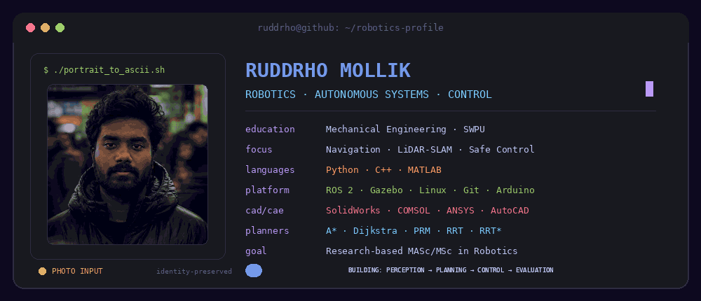
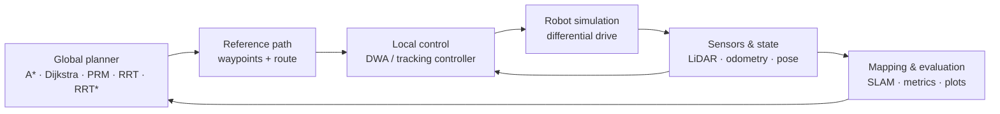

 

 

## `ruddrho@github ~ $ whoami`

I am a Mechanical Engineering undergraduate at **Southwest Petroleum University**, focused on **robotics, autonomous navigation, LiDAR-SLAM, motion planning, and control systems**.

I build simulation-first robotics projects that make algorithms observable and comparable: same environment, same start and goal, measurable planner performance, reproducible outputs, and clear visual evidence. My long-term goal is a research-based **MASc/MSc in autonomous mobile robots, control, navigation, or SLAM**.

- Current work: multi-algorithm robot navigation using A*, Dijkstra, RRT, RRT*, PRM, DWA, LiDAR, and SLAM
- Engineering approach: model → simulate → measure → compare → improve
- Research direction: uncertainty-aware mapping, safe planning, sensor anomalies, and resilient robot decision-making
- Learning track: ROS 2, Gazebo, Nav2, SLAM Toolbox, perception, localization, and sensor fusion

## `./research-focus --verbose`

| Area | What I work on |
|---|---|
| **Perception & Mapping** | 2D LiDAR, occupancy grids, live SLAM, camera pipelines, and environment representation |
| **Planning** | A*, Dijkstra, PRM, RRT, RRT*, local planning, and comparative benchmarking |
| **Control** | PID, LQR, fuzzy control, DWA, nonlinear control, trajectory tracking, and differential-drive motion |
| **Robotics Systems** | ROS 2 nodes, topics, services, actions, TF2, URDF/Xacro, ros2_control, Gazebo, RViz, and Arduino prototyping |
| **Reliability** | Sensor uncertainty, anomaly-aware navigation, safe behavior, reproducible evaluation, and failure analysis |

## `./stack --robotics`

### Core Programming & Engineering Tools

### Robotics Platform

### CAD, CAE & Embedded Prototyping

## `ls ./featured-projects`

| Project | Engineering scope | Evidence produced |
|---|---|---|
| **[Multi-Algorithm Robot Navigation](https://github.com/ruddrho/matlab-multi-algorithm-robot-navigation)** | Compares A*, Dijkstra, RRT, RRT*, and PRM in a shared MATLAB environment with a common DWA local controller, LiDAR sensing, and live SLAM. | Synchronized simulations, planner metrics, trajectories, occupancy maps, images, CSV results, and videos |
| **[3D UGV Trajectory Tracking](https://github.com/ruddrho/3D-UGV-Trajectory-Tracking-Adaptive-Nonlinear-Control-MATLAB)** | Adaptive nonlinear control for 3D unmanned-ground-vehicle trajectory tracking in MATLAB. | Tracking response, controller behavior, and simulation plots |
| **[PID-Controlled Quadcopter Simulation](https://github.com/ruddrho/PID-Controlled-Quadcopter-Simulation)** | Cascaded PID control for nonlinear quadcopter trajectory tracking using MATLAB/Simulink. | Closed-loop simulation and trajectory tracking results |
| **[PID–LQR–Fuzzy Mobile Robot Tracking](https://github.com/ruddrho/pid-lqr-fuzzy-mobile-robot-trajectory-tracking)** | Comparative study of PID, LQR, and fuzzy-logic controllers for mobile-robot trajectory tracking. | Controller comparison, error behavior, and MATLAB visualizations |
| **[Advanced Mobile Robot Navigation](https://github.com/ruddrho/advanced-mobile-robot-navigation)** | Autonomous mobile-robot navigation with path planning, DWA, LiDAR, SLAM, and route tracking. | Navigation trajectories, mapping results, and simulation outputs |
| **[SLAM Live Occupancy Map](https://github.com/ruddrho/slam_live_occupancy_map)** | Differential-drive robot simulation using A*, DWA, 360° LiDAR, route locking, and live occupancy mapping. | Live SLAM map, explored-space metrics, and recorded navigation |

 

New repositories automatically appear on the complete projects page. Featured projects above are selected manually.

## `cat ./architecture.txt`

## `./roadmap --current`

- Build a complete ROS 2 mobile-robot stack with URDF/Xacro, TF2, Gazebo, RViz, ros2_control, LiDAR, camera, and IMU
- Integrate SLAM Toolbox, Nav2, AMCL, and robot_localization for mapping, planning, localization, and sensor fusion
- Reimplement selected planning and control components in Python and C++ for ROS 2
- Extend navigation experiments toward uncertainty-aware mapping, sensor-anomaly handling, and safe decision-making
- Publish reproducible experiments with configuration files, metrics, videos, limitations, and failure cases

## `./contributions.sh`

 

<picture>
  <source media="(prefers-color-scheme: dark)" srcset="./assets/github-contribution-grid-snake-dark.svg" />
  
</picture>

## `./currently-exploring`

`ROS 2 Jazzy` · `Gazebo Harmonic` · `Nav2` · `SLAM Toolbox` · `TF2` · `URDF/Xacro` · `ros2_control` · `OpenCV` · `Arduino Integration` · `EKF/UKF Sensor Fusion` · `Safe Motion Planning` · `Robot Learning`

## `./connect`

  

> **“Build robots that can sense uncertainty, plan safely, and explain why they move.”**

Designed in Tokyo Night · Generated assets are stored in this repository · Contribution data refreshes daily

